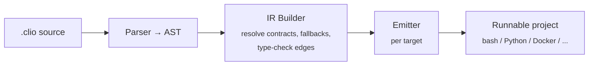

# CLIO

**Compiled Language for Intent Orchestration**

CLIO is a declarative language that compiles hybrid LLM/code programs into executable projects. You describe *what* you want — the compiler decides *what runs as code and what runs as an LLM*, then emits a project you can run directly.

```
STEP detect_churn
  TAKES:     customers: CSV
  GIVES:     risks: List<{client: str, risk: enum(low|mid|high), reason: str}>
  MODE:      judgment
  CACHE:     ttl(24h)
  VALIDATE:  each risk.reason cites a column from customers
  ON_FAIL:   retry(3) then escalate
```

## The problem

Every LLM-powered system today is a handwired mix of prompts, scripts, API calls, and glue code. The wiring is fragile, the LLM parts are non-deterministic, and nothing is reusable.

Existing tools each solve a piece: DSPy optimizes prompts, LangGraph orchestrates agents, Outlines constrains outputs, Prefect manages dataflows. None of them unify deterministic code and LLM reasoning in a single composable abstraction.

## The idea

Three primitives:

- **STEP** — an atomic unit of work. Declares inputs, outputs, and a `MODE`: `exact` (deterministic code), `judgment` (needs an LLM), or `auto` (compiler decides).
- **CONTRACT** — a typed shape guarantee (`SHAPE`, `ASSERT`, `CONFIDENCE`) that makes stochastic LLM output composable with deterministic code downstream.
- **FLOW** — a directed graph of steps with control flow (`FOR EACH`, `WHILE`, `IF`, `MATCH/CASE`) and failure strategies (`retry`, `fallback`, `escalate`).

A compiler parses `.clio` files into an intermediate representation, optimizes it (batching, context budgeting, model routing), and emits a runnable project for a chosen target.



See [docs/ARCHITECTURE.md](docs/ARCHITECTURE.md) for the full pipeline and IR build passes.

## Compilation targets

The same `.clio` source compiles to different targets:

| Target       | Output                                              |
|--------------|------------------------------------------------------|
| `claude-cli` | Claude Code project (CLAUDE.md, hooks, bash scripts) |
| `python`     | Python package (Pydantic + Anthropic SDK)            |
| `rust`       | Cargo project + API calls for judgment steps         |
| `docker`     | Multi-stage Dockerfile (mixed languages)             |

## Quick start

```bash
# Compile a .clio file to a Claude Code project
python -m clio compile examples/retention.clio --target claude-cli --output ./output

# Validate syntax without emitting
python -m clio check examples/retention.clio

# Render the FLOW as a Mermaid diagram (paste into a GitHub PR)
python -m clio graph examples/retention.clio
python -m clio graph examples/retention.clio --format dot --output flow.dot

# Generate a .clio source from a natural-language description (requires anthropic[gen] extra)
export ANTHROPIC_API_KEY=...
python -m clio gen "Pour chaque article, extrais les entités et résume-les" > flow.clio
python -m clio compile flow.clio --target python --output ./out

# Run tests
pytest tests/ -v
```

## Example

```
CONTRACT at_risk_account
  SHAPE:      {client: str, risk: enum(low|mid|high), reason: str(max=300)}
  ASSERT:     len(reason) > 0

STEP load_customers
  TAKES:     file: CSV
  GIVES:     customers: List<{name: str, revenue: float, last_order: str}>
  MODE:      exact

STEP detect_churn
  TAKES:     customers: List<{name: str, revenue: float, last_order: str}>
  GIVES:     risks: List<at_risk_account>
  MODE:      judgment
  CACHE:     ttl(24h)
  VALIDATE:  each risk.reason cites a column from customers
  ON_FAIL:   retry(3) then escalate

STEP check_zendesk_ticket
  TAKES:     client: str
  GIVES:     last_ticket: {subject: str, date: str, status: str}
  MODE:      exact

STEP write_retention_email
  TAKES:     risk: at_risk_account, ticket: {subject: str, date: str, status: str}
  GIVES:     email: {subject: str, body: str}
  MODE:      judgment
  CACHE:     on

FLOW customer_retention
  load_customers(file="customers.csv")
    -> detect_churn(customers)
    -> FOR EACH risk IN risks:
         check_zendesk_ticket(risk.client)
           -> write_retention_email(risk, last_ticket)

  IF detect_churn.FAILS:
    -> abort("Cannot detect churn — check CSV format")

RESOURCES
  prefer:     quality
  models:     [haiku, sonnet]
  strategy:   escalate
  target:     claude-cli
  lang:       python
```

## Project structure

```
clio/
  parser/          # .clio source → AST
  ir/              # intermediate representation, optimization
  emitters/        # IR → target project
  cli.py           # entry point
tests/
docs/
  LANGUAGE_SPEC.md
  ARCHITECTURE.md
  COMPILATION_TARGETS.md
```

## Documentation

- [Language Specification](docs/LANGUAGE_SPEC.md) — full grammar, types, and keywords
- [Architecture](docs/ARCHITECTURE.md) — compiler pipeline, design decisions
- [Compilation Targets](docs/COMPILATION_TARGETS.md) — what each target emits
- [Design Document (FR)](docs/clio-spec.md) — original design rationale (in French)

## Current status

**v0.3 (current)**: v0.2 + `target: python` emitter. The same `.clio` source compiles to either a Claude Code project (bash + claude-cli) or a runnable Python package (Anthropic SDK + Pydantic). Both targets implement identical CACHE + ON_FAIL semantics; their `.cache/` layouts are interchangeable. See the v0.3 design at `docs/superpowers/specs/2026-05-03-clio-v0.3-python-emitter-design.md`.

**Phase 2** (future): natural language → `.clio` frontend, additional emitters (`docker`, OpenAI-flavored Python), control flow (`FOR EACH`, `WHILE`, `IF`, `MATCH`), `MODE: auto` inference, optimizer (batching, model routing, context budget), `CONFIDENCE` thresholds, `VALIDATE` post-conditions, async step execution.

## License

MIT — see [LICENSE](LICENSE).
