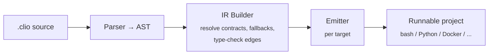

# CLIO

**Compiled Language for Intent Orchestration**

[](https://github.com/Sandjab/clio/actions/workflows/ci.yml)
[](https://github.com/Sandjab/clio/commits/main)
[](LICENSE)
[](https://www.python.org)
[](https://github.com/Sandjab/clio/releases/tag/v0.8.0)
[](https://github.com/Sandjab/clio)

CLIO is a declarative language that compiles hybrid LLM/code programs into executable projects. You describe *what* you want — the compiler decides *what runs as code and what runs as an LLM*, then emits a project you can run directly.

```
STEP detect_churn
  TAKES:     customers: CSV
  GIVES:     risks: List<{client: str, risk: enum(low|mid|high), reason: str}>
  MODE:      judgment
  CACHE:     ttl(24h)
  VALIDATE:  each risk.reason cites a column from customers
  ON_FAIL:   retry(3) then escalate
```

## The problem

Every LLM-powered system today is a handwired mix of prompts, scripts, API calls, and glue code. The wiring is fragile, the LLM parts are non-deterministic, and nothing is reusable.

Existing tools each solve a piece: DSPy optimizes prompts, LangGraph orchestrates agents, Outlines constrains outputs, Prefect manages dataflows. None of them unify deterministic code and LLM reasoning in a single composable abstraction.

## The idea

Three primitives:

- **STEP** — an atomic unit of work. Declares inputs, outputs, and a `MODE`: `exact` (deterministic code), `judgment` (needs an LLM), or `auto` (compiler decides).
- **CONTRACT** — a typed shape guarantee (`SHAPE`, `ASSERT`, `CONFIDENCE`) that makes stochastic LLM output composable with deterministic code downstream.
- **FLOW** — a directed graph of steps with control flow (`FOR EACH`, `WHILE`, `IF`, `MATCH/CASE`) and failure strategies (`retry`, `fallback`, `escalate`).
  - `FOR EACH ... PARALLEL AS <name>:` — fan a STEP over a collection in parallel, collect typed results.

A compiler parses `.clio` files into an intermediate representation, optimizes it (batching, context budgeting, model routing), and emits a runnable project for a chosen target.



See [docs/ARCHITECTURE.md](docs/ARCHITECTURE.md) for the full pipeline and IR build passes.

## Compilation targets

The same `.clio` source compiles to different targets:

| Target       | Output                                              |
|--------------|------------------------------------------------------|
| `claude-cli` | Claude Code project (CLAUDE.md, hooks, bash scripts) |
| `mcp-server` | MCP server (FLOW = tool, judgment via `sampling/createMessage`) |
| `python`     | Python package (Pydantic + Anthropic SDK)            |
| `rust`       | Cargo project + API calls for judgment steps         |
| `docker`     | Multi-stage Dockerfile (mixed languages)             |

## Quick start

```bash
# Compile a .clio file to a Claude Code project
python -m clio compile examples/retention.clio --target claude-cli --output ./output

# Validate syntax without emitting
python -m clio check examples/retention.clio

# Render the FLOW as a Mermaid diagram (paste into a GitHub PR)
python -m clio graph examples/retention.clio
python -m clio graph examples/retention.clio --format dot --output flow.dot

# Generate a .clio source from a natural-language description (requires anthropic[gen] extra)
export ANTHROPIC_API_KEY=...
python -m clio gen "Pour chaque article, extrais les entités et résume-les" > flow.clio
python -m clio compile flow.clio --target python --output ./out

# Compile to a runnable MCP server (each FLOW becomes a tool)
python -m clio compile examples/mvp.clio --target mcp-server --output ./mcp-out
pip install -e ./mcp-out
# then add the server to your MCP client config — see ./mcp-out/README.md

# Run tests
pytest tests/ -v
```

### Observability

Set `CLIO_LOG=1` to emit structured JSON-Line events to stderr, or
`CLIO_LOG_FILE=run.jsonl` to redirect to a file:

```bash
CLIO_LOG=1 CLIO_LOG_FILE=run.jsonl python -m my_compiled_flow
```

Six event types cover flow start/end, step start/end (with `mode`,
`duration_ms`, optional `cache_hit`/`model`/`tokens_*`), and
parallel-block start/end. The schema is OTel-mappable. See
[docs/LANGUAGE_SPEC.md](docs/LANGUAGE_SPEC.md) for the full reference.

### Resume

If a long pipeline crashes mid-flow, resume from the last completed step:

```bash
python -m my_compiled_flow --from-step 3
```

The package writes `state.json` after each completed step (path via
`CLIO_STATE_FILE`). See [docs/LANGUAGE_SPEC.md](docs/LANGUAGE_SPEC.md)
for the schema.

## Example

This is `examples/mvp.clio` — it compiles to both `claude-cli` and `python` with no edits beyond filling the EXACT step bodies.

```
CONTRACT customer_risk
  SHAPE:  {client: str, risk: enum(low|mid|high), reason: str(max=300)}
  ASSERT: len(reason) > 0

STEP load_customers
  TAKES: file:      CSV
  GIVES: customers: List<{name: str, revenue: float}>
  MODE:  exact

STEP detect_churn_naive
  TAKES: customers: List<{name: str, revenue: float}>
  GIVES: risks:     List<customer_risk>
  MODE:  exact

STEP detect_churn
  TAKES:    customers: List<{name: str, revenue: float}>
  GIVES:    risks:     List<customer_risk>
  MODE:     judgment
  CACHE:    ttl(24h)
  ON_FAIL:  retry(3) then escalate then fallback(detect_churn_naive) then abort("churn detection exhausted")

FLOW customer_retention
  load_customers(file="customers.csv")
    -> detect_churn(customers)

RESOURCES
  target:  claude-cli
  models:  [haiku, sonnet, opus]
```

The compiler reads this and emits a runnable project with: a typed `CustomerRisk` Pydantic model with the `len(reason) > 0` assertion, a `detect_churn` step that calls the LLM with the inlined JSON Schema and a 24-hour cache, and a resilience chain — three retry attempts on Haiku, escalation to Sonnet (one attempt), fallback to the deterministic `detect_churn_naive` step, and finally `abort` with an explicit message. None of that wiring is hand-written.

See [`examples/`](examples/) for the full set: `mvp.clio` (above), `entities.clio` (NER + summary, two contracts, nested record types), and `classify_corpus.clio` (FOR EACH + OpenAI-compat via LiteLLM/Gemini).

## Project structure

```
clio/
  parser/          # .clio source → AST
  ir/              # intermediate representation, optimization
  emitters/        # IR → target project
  cli.py           # entry point
tests/
docs/
  LANGUAGE_SPEC.md
  ARCHITECTURE.md
  COMPILATION_TARGETS.md
```

## Documentation

- **[User manual](docs/manual/README.md)** — start here. Tutorial, language tour, cookbook, CLI reference, troubleshooting.
- [Language specification](docs/LANGUAGE_SPEC.md) — full grammar, types, and keywords (authoritative reference).
- [Architecture](docs/ARCHITECTURE.md) — compiler pipeline, design decisions.
- [Compilation targets](docs/COMPILATION_TARGETS.md) — what each target emits.
- [Positioning](docs/POSITIONING.md) — strategy, comparisons (DSPy, LangGraph, Outlines).
- [Design document (FR)](docs/clio-spec.md) — original design rationale (in French).
- [Examples README](examples/README.md) — guided tour of the polished `.clio` files in `examples/`.
- [Changelog](CHANGELOG.md) — what's landed in each tag.

## Current status

**v0.6.0 (current)**: 3 compilation targets (`claude-cli`, `python`, `mcp-server`). 6 polished examples (mvp, entities, classify_corpus, parallel_classify, rag_basic, rag_selfcontained, ticket_routing). Rich-card HTML viewer (`clio graph --format html`). `FOR EACH PARALLEL`, `impl.shell parse:json`, `ASSERT` chained comparators (`0.0 <= score <= 1.0`), step-granularity resume on the python target. 403 unit tests + 13 gated e2e.

**Phase 2** (future): natural language → `.clio` frontend (the `gen` command is a first cut), additional emitters (LangGraph bridge, OpenAI-flavored Python), control flow (`WHILE`, `IF`, `MATCH`), `MODE: auto` inference, optimizer (batching, model routing, context budget), `CONFIDENCE` thresholds, `VALIDATE` post-conditions, async step execution.

## License

MIT — see [LICENSE](LICENSE).
