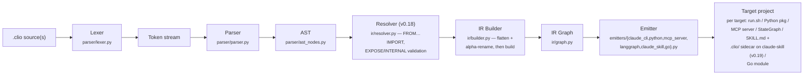

# CLIO Architecture

## Pipeline



### Layer 1: Parser (source → AST)

The parser is a hand-written recursive descent parser. No parser generators (PEG, ANTLR, Lark) until complexity demands it. Rationale: the grammar is small, error messages matter more than speed, and we want zero dependencies.

**Lexer** (`parser/lexer.py`): tokenizes `.clio` source into a stream of typed tokens. Keywords are a closed enum. Indentation is significant (Python-style blocks).

**Parser** (`parser/parser.py`): consumes tokens and produces an AST. Each grammar rule maps to one method. Errors reference the source line number.

**AST** (`parser/ast_nodes.py`): frozen dataclasses. One node type per declaration (`StepDecl`, `ContractDecl`, `FlowDecl`, `ResourcesDecl`) and per control structure (`ForEachBlock`, `WhileBlock`, `IfBlock`, `MatchBlock`). The suffix is always `Decl` or `Block` — never `Node`.

### Layer 2: IR (AST → executable graph)

The IR Builder transforms the AST into a directed graph of steps with typed edges. This is where:

- Contracts are resolved: each step's GIVES is checked against the CONTRACT it references
- Type checking happens: a step's TAKES must match the GIVES of the step feeding into it

`MODE` and `LANG` are carried through verbatim as parsed — the builder does not infer them, and it inserts no implicit steps.

**Graph** (`ir/graph.py`): the flow as a DAG of StepIR nodes. Each node holds its resolved contract, mode, lang, and connections. Since v0.17, `FlowGraph` also carries `flows` (every parsed `FlowIR`, not only the main one) and `exposed_flow_names` (those marked `EXPOSE` in the entry file — used by the `mcp-server` emitter to decide which FLOWs surface as tools). A call that resolves to a signed FLOW (one with both `TAKES` and `GIVES`) produces a `FlowCallIR` node — distinct from the regular `CallIR` for STEP invocations.

**Contracts** (`ir/contracts.py`): a single `type_to_json_schema` function that converts a CONTRACT's SHAPE type expression into JSON Schema. The IR Builder (`builder.py`) then attaches the ASSERT predicate (when present) as `x-clio-assert` on the schema. No Pydantic and no code generation happen at this layer — emitters embed the schema, and the `python` target's Pydantic models are produced by that emitter.

The IR build runs in passes. For the multi-file case, `build_ir` first validates and flattens the parsed files (resolver functions + `_flatten_to_program`, see [Multi-file resolution](#multi-file-resolution-v018)); then `_build_ir_single` builds the graph:

- builds each CONTRACT into a JSON-Schema-backed `ContractIR`
- **Pass 1** — build `StepIR`s (fallback refs left as placeholders; every TAKES/GIVES contract reference is checked)
- **Pass 2** — `_resolve_fallbacks`: resolve `ON_FAIL fallback(step)` references to `StepIR`s and check TAKES/GIVES compatibility
- **Pass 3** — `_detect_fallback_cycles`: DFS (white/gray/black) over the fallback graph
- **Pass 4** — build each FLOW (`_build_flow`), type-checking inter-step edges, guarded by `_detect_flow_call_cycles` against cyclic sub-flow calls

Each pass either succeeds or raises `IRBuildError` with a `<file>:<line>:<col>` message; later passes never see a partial graph.

### Multi-file resolution (v0.18)

`clio compile` first calls `resolve_imports` (`ir/resolver.py`) on the entry file: it walks the `FROM ... IMPORT` graph, parses every reachable file, and returns a `dict[Path, Program]` (one parsed `Program` per file), detecting import cycles along the way.

`build_ir` then runs the resolver's validation functions over that dict — `validate_per_file` (path/symbol/exposure checks), `compute_exposed_sets` (each file's `EXPOSE` set, resolving bare `EXPOSE <name>` re-exports), and `validate_imports` (every imported name is actually exposed; duplicate-import detection) — and `_flatten_to_program` (in `ir/builder.py`) merges the reachable files into a single alpha-renamed `Program`. Internal (non-exposed) symbols are prefixed `{file_stem}__{name}` to avoid collisions; exposed names keep their original form. RESOURCES and TEST blocks come from the entry file only.

After flattening, the IR Builder and all emitters are unaware of the cross-file origin: they see a standard single-file program. The alpha-renaming preserves CONTRACT shapes structurally — a `List<Article>` reference in `main.clio` that resolves to `schemas.clio::Article` becomes `List<schemas__Article>` in the merged namespace, with an identical `SHAPE` declaration carried over.

**Ownership:** `resolve_imports` is invoked by `clio/cli.py`; the per-file validation, exposed-set computation, import validation, and the flatten/alpha-rename all run inside `build_ir` (the validation functions live in `ir/resolver.py`, the flatten in `ir/builder.py`).

### Layer 3: Emitters (IR → target project)

Each target is a separate emitter class inheriting from `BaseEmitter`. An emitter takes an IR graph and writes files to disk.

**BaseEmitter** (`emitters/base.py`): abstract class defining the interface:
```python
class BaseEmitter(ABC):
    @abstractmethod
    def emit(
        self,
        graph: FlowGraph,
        output_dir: Path,
        *,
        source_path: Path | None = None,
        sources: tuple[Path, ...] | None = None,
    ) -> None: ...
```

Emitters depend only on the IR and shared type nodes (`TypeExpr` subtypes from `parser/ast_nodes`) — never on parser logic or builder internals. They are **not**, however, strictly isolated from one another: several share rendering logic through `_*_helpers` modules (e.g. `_python_helpers`, `_mcp_helpers`, `_go_helpers`), and the `langgraph` emitter delegates to `PythonEmitter` for the per-step code it reuses. Adding a new target = adding a new emitter file in `emitters/` (plus any helper module it needs).

## Key design decisions

### Why frozen dataclasses for the AST?

Immutability prevents accidental mutation during the IR build passes. Each pass produces new nodes rather than modifying in place. This makes debugging trivial: you can diff any two stages.

### Why not use an existing framework?

This project IS the framework. Depending on LangChain/DSPy/LangGraph would couple us to their abstractions, which are exactly what we're trying to replace. The whole point is that STEP/CONTRACT/FLOW is a better abstraction than anything those tools offer.

### Why hand-written parser?

The `keywords.py` enum has ~100 members, but the rule set is small and regular. A parser generator would add a dependency, obscure error messages, and make the lexer/parser harder to modify. We can always migrate later if the grammar grows.

### Why Pydantic for contracts?

Pydantic v2 compiles to JSON Schema natively. JSON Schema is the validation format that LLM structured outputs already use (Anthropic tool_use, OpenAI function calling). Pydantic is the bridge between the language's type system and the LLM's output constraints in the emitted `python` project.

### Why not depend on Guidance, Outlines, or Instructor?

These libraries solve the problem of constraining a *single LLM call* — Guidance and Outlines at the token level, Instructor at the API level with retry. They are excellent at what they do, but they operate one layer below us.

Our CONTRACT primitive needs validation, not constrained decoding. For API-based targets (`claude-cli`, `python`, `mcp-server`, `go`), validation is trivial: a JSON Schema check or a Pydantic model. No dependency needed. For local-model targets (future), Outlines or Guidance would be genuinely necessary to constrain at the tokenizer level.

Strategy: **no dependency today, keep the door open for day N.** Validation is currently inline per target — JSON Schema for API-based targets, Pydantic v2 in the emitted `python` project. There is no `ContractValidator` abstraction in the compiler yet; if local-model targets ever need token-level constraints, a pluggable validator interface (behind which Outlines or Guidance could sit) is the natural place to add one.

This follows principle #2: minimum code that solves the problem, nothing speculative.

## What the compiler does NOT do

- **It does not execute flows.** It emits projects that can be executed by their target runtime (bash, Python, Docker, etc.).
- **It does not call LLMs.** Emitters generate prompts and schemas. The runtime calls the LLM.
- **It does not manage state at runtime.** It generates the state-passing scaffolding. The runtime manages the actual state.
- **It does not constrain LLM decoding.** It emits schemas. The runtime (or a lib like Outlines) enforces them.
- **It does not infer, optimize, or route.** `MODE`/`LANG` are taken as written; there is no optimizer pass, no batching, no model routing, no implicit step insertion.

The compiler is a pure function: `.clio` in, project out.
