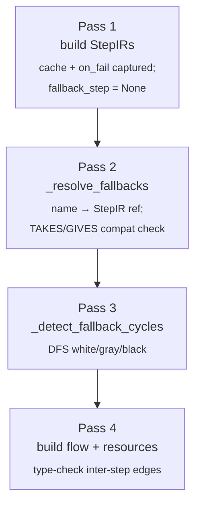

# CLIO Architecture

## Pipeline

```mermaid
flowchart LR
    src[".clio source"] --> lex["Lexer<br/><sub>parser/lexer.py</sub>"]
    lex --> tok["Token stream"]
    tok --> psr["Parser<br/><sub>parser/parser.py</sub>"]
    psr --> ast["AST<br/><sub>parser/ast_nodes.py</sub>"]
    ast --> bld["IR Builder<br/><sub>ir/builder.py</sub>"]
    bld --> ir["IR Graph<br/><sub>ir/graph.py</sub>"]
    ir --> opt["Optimizer<br/><sub>ir/optimizer.py (future)</sub>"]
    opt --> emt["Emitter<br/><sub>emitters/claude_cli.py</sub>"]
    emt --> out["Target project<br/><sub>run.sh + steps/ + clio_runtime/</sub>"]
```



### Layer 1: Parser (source → AST)

The parser is a hand-written recursive descent parser. No parser generators (PEG, ANTLR, Lark) until complexity demands it. Rationale: the grammar is small, error messages matter more than speed, and we want zero dependencies.

**Lexer** (`parser/lexer.py`): tokenizes `.clio` source into a stream of typed tokens. Keywords are a closed enum. Indentation is significant (Python-style blocks).

**Parser** (`parser/parser.py`): consumes tokens and produces an AST. Each grammar rule maps to one method. Errors reference the source line number.

**AST** (`parser/ast_nodes.py`): frozen dataclasses. One node type per declaration (StepNode, ContractNode, FlowNode, ResourcesNode) and per control structure (ForEachNode, WhileNode, IfNode, MatchNode).

### Layer 2: IR (AST → executable graph)

The IR Builder transforms the AST into a directed graph of steps with typed edges. This is where:

- Contracts are resolved: each step's GIVES is checked against the CONTRACT it references
- Type checking happens: a step's TAKES must match the GIVES of the step feeding into it
- Implicit steps are inserted: e.g., summarize steps for context overflow
- MODE inference runs: `auto` steps are classified as `exact` or `judgment`
- LANG inference runs: `auto` lang steps get a language assigned based on data size heuristics

**Graph** (`ir/graph.py`): the flow as a DAG of StepIR nodes. Each node holds its resolved contract, inferred mode, inferred lang, and connections.

**Contracts** (`ir/contracts.py`): validates SHAPE definitions against Pydantic models and JSON Schema. Generates the validation code/schema that emitters will embed.

**Optimizer** (`ir/optimizer.py`): runs passes on the IR graph:
- **Batching**: merges consecutive `judgment` steps without interleaving `exact` steps into a single LLM call
- **Context budgeting**: estimates token cost per step, inserts summarize steps if needed
- **Model routing**: assigns a model tier to each `judgment` step based on complexity heuristics

The IR build is itself a multi-pass process. Since v0.2 (`fallback(step)` resolution), `build_ir` runs four passes in order:



Each pass either succeeds or raises `IRBuildError` with a `<file>:<line>:<col>` message; later passes never see a partial graph.

### Layer 3: Emitters (IR → target project)

Each target is a separate emitter class inheriting from `BaseEmitter`. An emitter takes an optimized IR graph and writes files to disk.

**BaseEmitter** (`emitters/base.py`): abstract class defining the interface:
```python
class BaseEmitter(ABC):
    @abstractmethod
    def emit(self, graph: FlowGraph, output_dir: Path) -> None: ...
```

Emitters are pure functions of the IR. They never import from each other. Adding a new target = adding a new file in `emitters/`.

## Key design decisions

### Why frozen dataclasses for the AST?

Immutability prevents accidental mutation during optimization passes. Each pass produces a new graph rather than modifying in place. This makes debugging trivial: you can diff any two stages.

### Why not use an existing framework?

This project IS the framework. Depending on LangChain/DSPy/LangGraph would couple us to their abstractions, which are exactly what we're trying to replace. The whole point is that STEP/CONTRACT/FLOW is a better abstraction than anything those tools offer.

### Why hand-written parser?

The grammar has ~20 keywords and ~10 rules. A parser generator would add a dependency, obscure error messages, and make the lexer/parser harder to modify. We can always migrate later if the grammar grows.

### Why Pydantic for contracts?

Pydantic v2 compiles to JSON Schema natively. JSON Schema is the validation format that LLM structured outputs already use (Anthropic tool_use, OpenAI function calling). Pydantic is the bridge between the language's type system and the LLM's output constraints.

### Why not depend on Guidance, Outlines, or Instructor?

These libraries solve the problem of constraining a *single LLM call* — Guidance and Outlines at the token level, Instructor at the API level with retry. They are excellent at what they do, but they operate one layer below us.

Our CONTRACT primitive needs validation, not constrained decoding. For API-based targets (`claude-cli`, `python`), validation is trivial: JSON Schema check or Pydantic model. No need for a dependency. For local model targets (future), Outlines or Guidance would be genuinely necessary to constrain at the tokenizer level — impossible to rewrite reasonably.

Strategy: **no dependency on day 1, pluggable interface for day N.** The emitter uses a `ContractValidator` abstraction. Early implementations are inline (jsonschema, Pydantic). Future local-model emitters can plug in Outlines or Guidance behind the same interface.

This follows principle #2: minimum code that solves the problem, nothing speculative.

## What the compiler does NOT do

- **It does not execute flows.** It emits projects that can be executed by their target runtime (bash, Python, Docker, etc.).
- **It does not call LLMs.** Emitters generate prompts and schemas. The runtime calls the LLM.
- **It does not manage state at runtime.** It generates the state-passing scaffolding. The runtime manages the actual state.
- **It does not constrain LLM decoding.** It emits schemas. The runtime (or a lib like Outlines) enforces them.

The compiler is a pure function: `.clio` in, project out.
